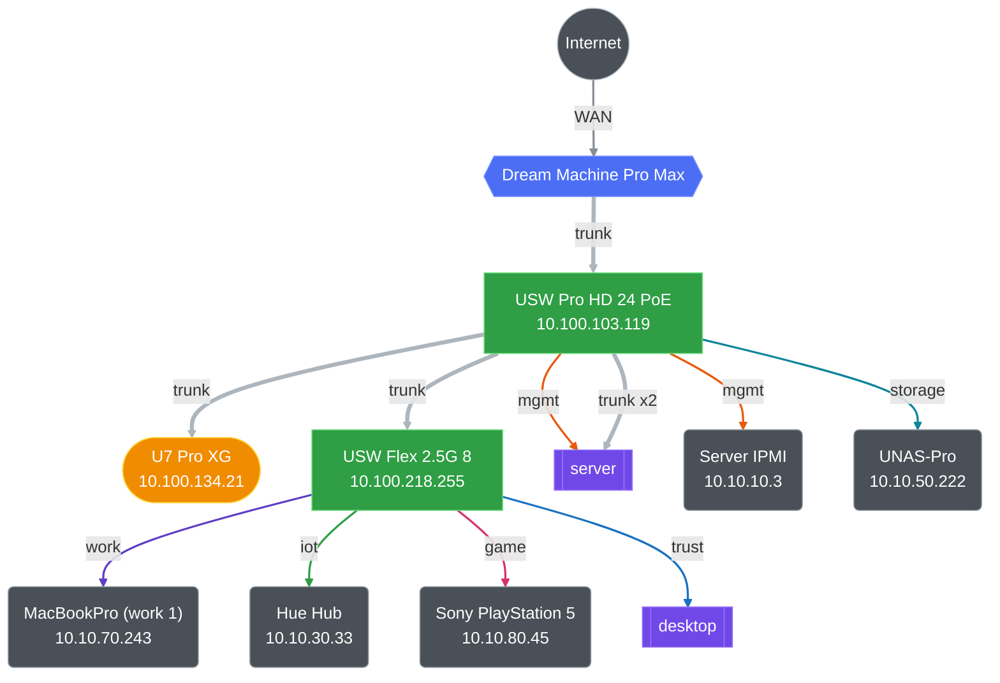

<!-- Generated by `just topology`. Do not edit. -->

```mermaid
flowchart TD
  internet(("Internet"))
  dream_machine_pro_max{{"Dream Machine Pro Max"}}
  u7_pro_xg(["U7 Pro XG<br/>10.100.134.21"])
  usw_flex_2_5g_8["USW Flex 2.5G 8<br/>10.100.218.255"]
  usw_pro_hd_24_poe["USW Pro HD 24 PoE<br/>10.100.103.119"]
  desktop[["desktop"]]
  server[["server"]]
  hue_hub("Hue Hub<br/>10.10.30.33")
  macbookpro_work_1("MacBookPro (work 1)<br/>10.10.70.243")
  playstation5("Sony PlayStation 5<br/>10.10.80.45")
  server_ipmi("Server IPMI<br/>10.10.10.3")
  unas_pro("UNAS-Pro<br/>10.10.50.222")

  internet -->|"WAN"| dream_machine_pro_max
  usw_flex_2_5g_8 -->|"work"| macbookpro_work_1
  usw_flex_2_5g_8 -->|"iot"| hue_hub
  usw_flex_2_5g_8 -->|"game"| playstation5
  usw_flex_2_5g_8 -->|"trust"| desktop
  usw_pro_hd_24_poe ==>|"trunk"| u7_pro_xg
  usw_pro_hd_24_poe -->|"mgmt"| server
  usw_pro_hd_24_poe -->|"mgmt"| server_ipmi
  usw_pro_hd_24_poe ==>|"trunk"| usw_flex_2_5g_8
  usw_pro_hd_24_poe ==>|"trunk x2"| server
  dream_machine_pro_max ==>|"trunk"| usw_pro_hd_24_poe
  usw_pro_hd_24_poe -->|"storage"| unas_pro

  classDef internet     fill:#495057,stroke:#adb5bd,color:#fff;
  classDef router       fill:#4c6ef5,stroke:#748ffc,color:#fff;
  classDef switch       fill:#2f9e44,stroke:#69db7c,color:#fff;
  classDef accessPoint  fill:#f08c00,stroke:#ffd43b,color:#fff;
  classDef host         fill:#7048e8,stroke:#9775fa,color:#fff;
  classDef device       fill:#495057,stroke:#868e96,color:#fff;
  class internet internet;
  class dream_machine_pro_max router;
  class usw_flex_2_5g_8,usw_pro_hd_24_poe switch;
  class u7_pro_xg accessPoint;
  class desktop,server host;
  class hue_hub,macbookpro_work_1,playstation5,server_ipmi,unas_pro device;

  linkStyle 0 stroke:#868e96,stroke-width:2px;
  linkStyle 1 stroke:#5f3dc4,stroke-width:2px;
  linkStyle 2 stroke:#2f9e44,stroke-width:2px;
  linkStyle 3 stroke:#d6336c,stroke-width:2px;
  linkStyle 4 stroke:#1971c2,stroke-width:2px;
  linkStyle 5 stroke:#adb5bd,stroke-width:4px;
  linkStyle 6 stroke:#e8590c,stroke-width:2px;
  linkStyle 7 stroke:#e8590c,stroke-width:2px;
  linkStyle 8 stroke:#adb5bd,stroke-width:4px;
  linkStyle 9 stroke:#adb5bd,stroke-width:4px;
  linkStyle 10 stroke:#adb5bd,stroke-width:4px;
  linkStyle 11 stroke:#0c8599,stroke-width:2px;
```
